## Requirements Definition
The CoD‑dex system is designed to let users search, view, and collect Call of Duty characters using a local Flask API and a Python command‑line interface.
 The following requirements describe the features, behaviours, and properties the system must have.
 Each requirement is verifiable through testing.
## Functional Requirements
The system must allow users to search for characters using keywords.  
*Verified by entering a keyword and checking that matching results appear.*  

The system must retrieve character data from a local Flask API.  
 *Verified by running the API and confirming JSON responses.* 

The system must allow users to add characters to their personal CoD‑dex. 
 *Verified by adding a character and checking that it appears in the codex.* 

The system must allow users to view their CoD‑dex.  
 *Verified by selecting “View CoD‑dex” and confirming the output.* 

The system must allow users to remove characters from their CoD‑dex. 
 *Verified by removing a character and confirming it no longer appears.* 

The system must record user interactions (searches, additions, removals). 
 *Verified by checking interaction_log.txt.* 

The system must generate visualisations using Matplotlib. 
 *Verified by selecting chart options and confirming the charts appear.* 

The system must handle invalid menu choices gracefully. 
 *Verified by entering invalid input and checking for an error message.* 

## Determining Specifications
This section outlines the functional and non‑functional specifications of the CoD‑dex system, including inputs, outputs, and use cases.

### Functional Specifications
#### Character Search  
What it does:
    
    Allows users to search for characters using keywords.
Input:
    
     A string entered by the user (e.g., “ghost”, “141”).
Output:
 A list of matching characters or a message saying no results were found.
Use Case:
 A user types “ghost” → the system returns Simon “Ghost” Riley.

#### Add Character to CoD‑dex
What it does:

    Adds a character to the user’s personal collection.
Input:
 
    Character name.
Output:
 
    Confirmation message and updated codex.
Use Case:
 
    User enters “Price” → Price is added to their CoD‑dex.

#### View CoD‑dex
What it does:
 
    Displays all characters the user has collected.
Input:
 
    Menu selection.
Output:
 
    A printed list of character entries.
Use Case:

    User selects “View CoD‑dex” → sees all saved characters.

#### Remove Character
What it does:
 
    Removes a character from the user’s collection.
Input:
 
    Character name.
Output:
 
    Confirmation message and updated codex.
Use Case:
 
    User removes “Ghost” → Ghost no longer appears in their codex.

#### User Interaction Logging
What it does:
 
    Records user actions such as searches, additions, removals, and codex views.
Input:
 
    Any user action.
Output:
 
    A line appended to interaction_log.txt.
Use Case:
 
    User searches “Makarov” → log file records: Searched for: Makarov.

#### Data Visualisation (Matplotlib)
What it does:
 
    Generates charts based on character and codex data.
Input:
 
    Menu selection.
Output:
 
    A Matplotlib window showing:
        Characters per faction
        Characters per game
        CoD‑dex progress
Use Case:
 
    User selects “Characters per Game” → a bar chart appears.

### Non‑Functional Specifications
#### User Perspective 
Usability:
 
    The menu must be simple, readable, and easy to navigate.
Responsiveness:
 
    Searches and API calls should return results quickly.
Error Handling:
 
    The system must not crash on invalid input.
Accessibility:
 
    The CLI must run on Windows, macOS, and Linux.

#### Developer Perspective
Modularity:
 
    Code must be separated into logical files (API, codex logic, CLI, charts).
Maintainability:
 
    Functions must be readable and documented.
Extensibility:
 
    New characters, charts, or API routes should be easy to add.
Version Control:
 
    All development must be tracked in GitHub.

## Integration Evaluation
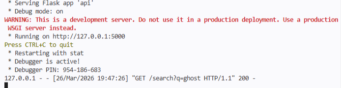 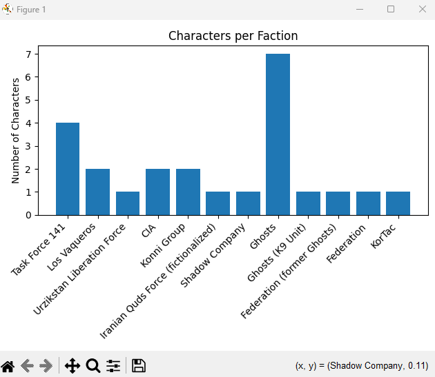
The system successfully integrates a local Flask API and the Matplotlib library.
The API provides character data to the main program, and the CLI retrieves this data using HTTP requests. Searches return results correctly, confirming that the API is functioning as intended.
Matplotlib has also been integrated to generate visualisations such as “Characters per Faction,” “Characters per Game,” and “CoD‑dex Progress.” These charts display correctly in separate windows, demonstrating that the module is working and receiving data from the program.
Overall, the integration of both the API and external Python modules is functional and stable. The program responds quickly, handles user input, and produces accurate visual output.
## Development Evaluation
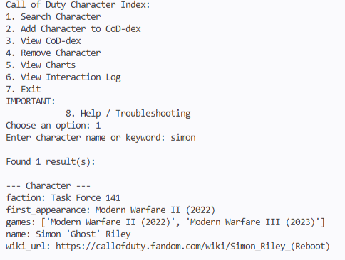
The user interface displays a clear numbered menu and responds correctly to user input. Each option leads to the appropriate function, such as searching characters or viewing the CoD-dex. Invalid inputs are handled with an error message. At this stage, the interface is functional and allows basic interaction, although some features (e.g., charts or extended error handling) may still be under development.

## Peer Testing - Arisa
Izzy's project is a very well-designed and highly functional design. Although I don't know much about Call of Duty, this application allows me to familiarise myself with characters within all series of games. In terms of non-functional requirements, this system responds to user inputs within 1 second and gracefully displays error messages due to user input mistakes. Since I am one person I cannot do any load testing and verify if this program is usable concurrently. Additionally, there is a comprehensive variety of actions the users can take and the visualisations and overall UX were easy to understand. The README file assists in enhancing user and developer understanding of the program and its features, although one future improvement could be to outline some instructions with visuals guiding users on how to use the program and download dependencies for a more easy and guided navigational experience.

## Peer Testing - Yuna
The program is very clear and simple and produces easy to read outputs. The functional requirements portrayed everything that was used in the code and the list function was pleasing to use. When searching for the driver name, it was really cool to see that you could also use nicknames or how one name could output multiple people. I also liked how whenever a new character was searched for, it was mentioned under a heading so that the user wouldn't get confused and overwhelmed with the lines and lines of words. The loading only took one second and the charts provided were informative and produced everything needed. Since I only have one body, it would be hard to determine the functionality of the load testing. The README.md did mention most things but it would have been better if it was more informative as if a new user were to use the program, it could be a bit confusing to use at first. 

## Data Dictionary

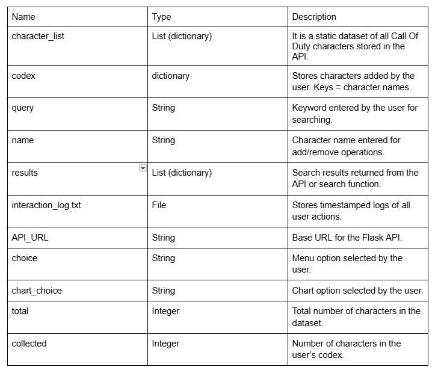

## Gantt Chart
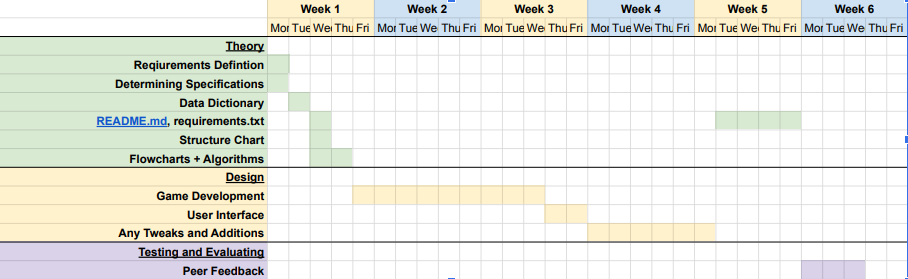
## Routines and Subroutines
### Main Menu Loop
#### Flowchart
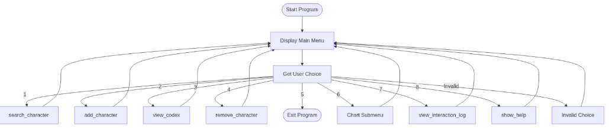
#### Algorithim

    loop forever:
    display menu
    choice = input()

    if choice == "1":
        call search_character()
    elif choice == "2":
        call add_character()
    elif choice == "3":
        call view_codex()
    elif choice == "4":
        call remove_character()
    elif choice == "5":
        break loop
    elif choice == "6":
        show chart submenu
    elif choice == "7":
        call view_interaction_log()
    elif choice == "8":
        call show_help()
    else:
        print invalid choice

### Chart Submenu
#### Flowchart
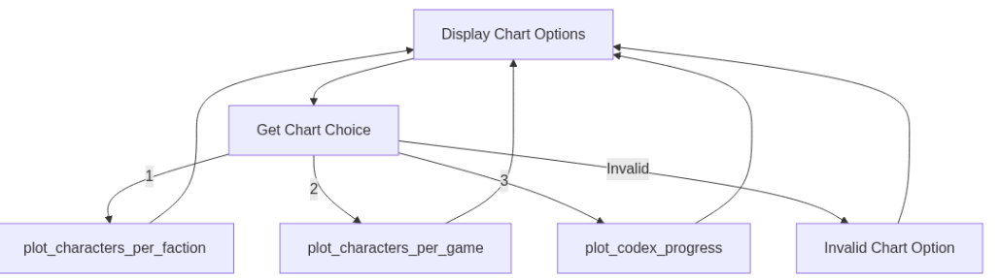
#### Algorithim

    display chart menu
    chart_choice = input()
    if chart_choice == "1":  
        plot_characters_per_faction()  
    elif chart_choice == "2":  
        plot_characters_per_game()  
    elif chart_choice == "3":  
        plot_codex_progress()  
    else:  
        print invalid chart option  

### search_character(name)
#### Flowchart
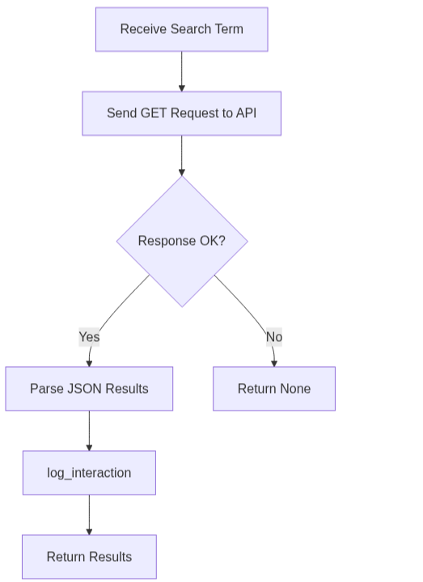
#### Algorithim
    
    function search_character(name):  
        send GET request to API  
        log_interaction("Searched for: name")  
        if response OK:  
            return results  
        else:  
            return None  

### add_character(name)
#### Flowchart
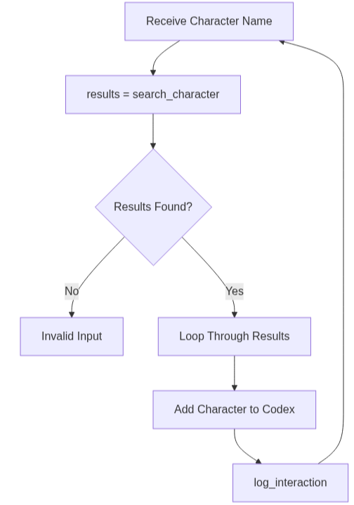
#### Algorithim

    function add_character(name):  
        results = search_character(name)  
        if results exist:  
            for each character:  
                add to codex  
                log_interaction("Added: character")  
        else:  
            print invalid input  

### remove_character(name)
#### Flowchart
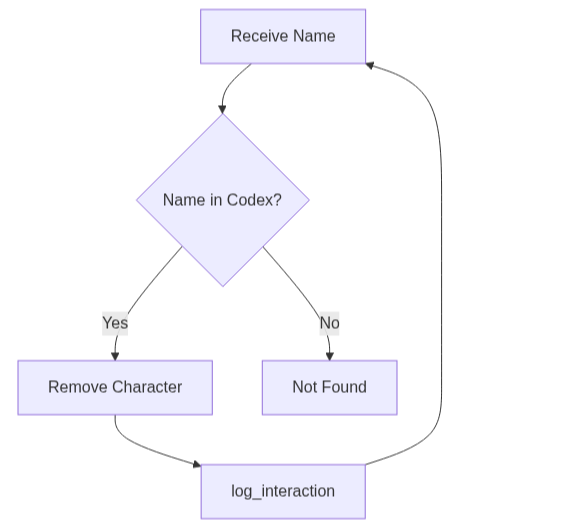
#### Algorithim

    function remove_character(name):  
        if name in codex:  
            remove from codex  
            log_interaction("Removed: name")  
        else:  
            print not found  

### view_codex()
#### Flowchart
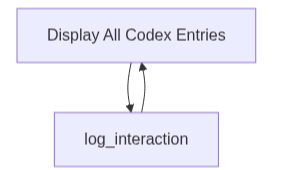
#### Algorithim
    
    function view_codex():  
    print all codex entries  
    log_interaction("Viewed CoD-dex")  

### view_interaction_log()
#### Flowchart
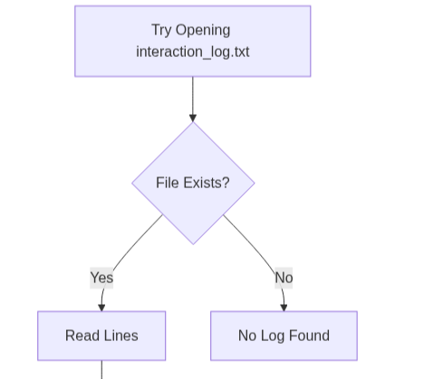
#### Algorithim
    
    function view_interaction_log():  
    try:  
        open file  
        read lines  
        print each line  
    except FileNotFoundError:  
        print no log found  

### show_help()
#### Flowchart
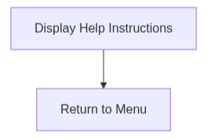
#### Algorithim
    
    function show_help():  
        print instructions  
        print troubleshooting tips  

### plot_characters_per_faction()
#### Flowchart
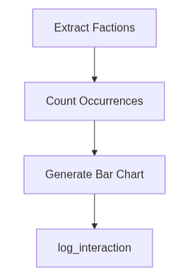
#### Algorithim
    
    function plot_characters_per_faction():  
        extract factions  
        count occurrences  
        plot bar chart  
        log_interaction("Viewed charts")  

### plot_characters_per_game()
#### Flowchart
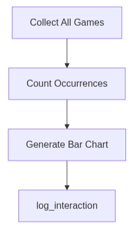
#### Algorithim
    
    function plot_characters_per_game():  
        gather all games  
        count occurrences  
        plot bar chart  
        log_interaction("Viewed charts")  

### plot_codex_progress()
#### Flowchart
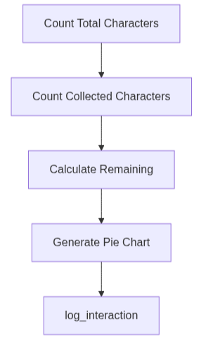
#### Algorithim
    function plot_codex_progress():  
        total = number of characters  
        collected = number in codex  
        remaining = total - collected  
        plot pie chart  
        log_interaction("Viewed charts")  

### search_character(query)
#### Flowchart
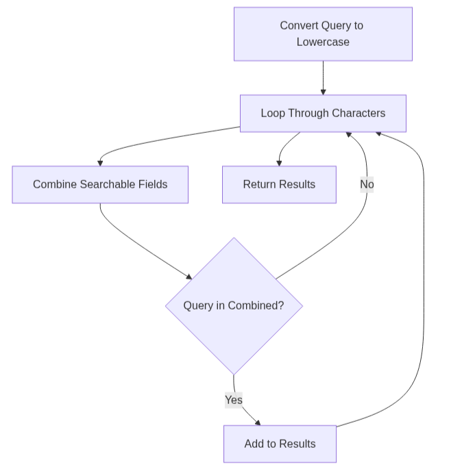
#### Algorithim
    function search_character(query):  
        convert query to lowercase  
        results = empty list  
        for each character:  
            combine searchable fields  
            if query in combined:  
                add character to results  
        return results  

### /characters<name>
#### Flowchart
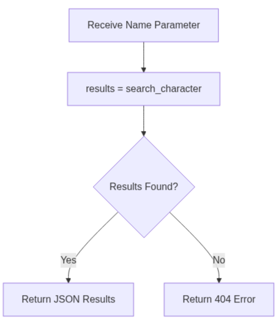
#### Algorithim
    function get_character(name):  
        results = search_character(name)  
        if results exist:  
            return results as JSON   
        else:  
            return error JSON with 404  

### /characters
#### Flowchart
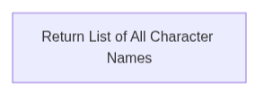
#### Algorithim
    function list_characters():  
        return list of all character names  

### /search?q=keyword
#### Flowchart
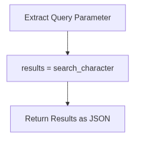
#### Algorithim
    function search():  
        query = request parameter  
        results = search_character(query)  
        return results as JSON  

## Structure Chart
